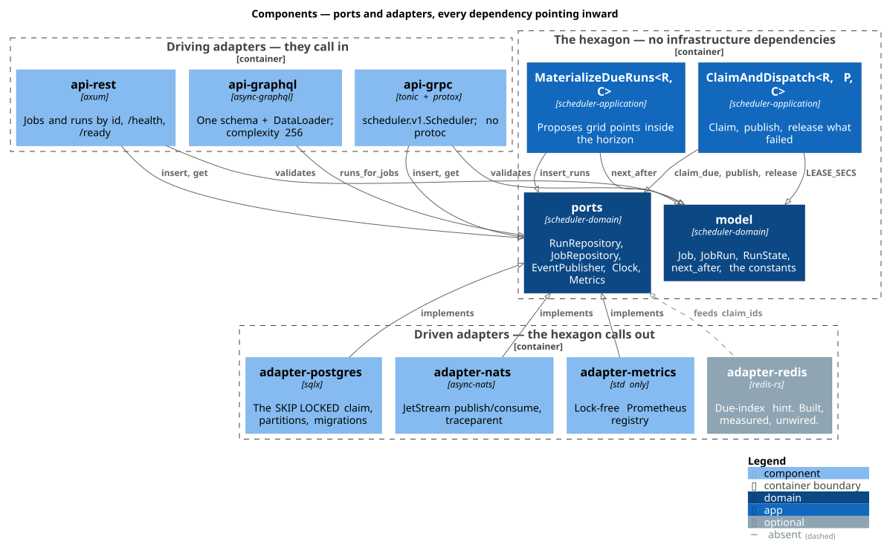
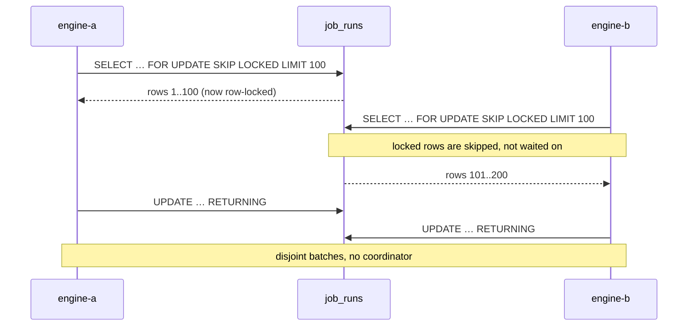
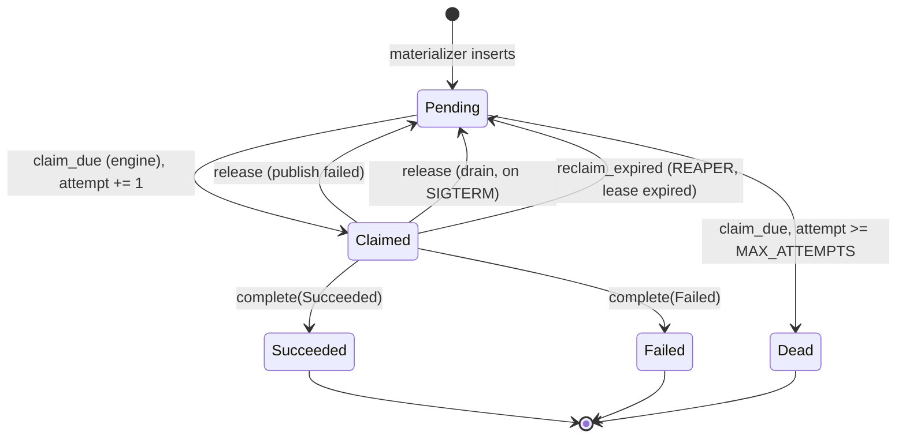
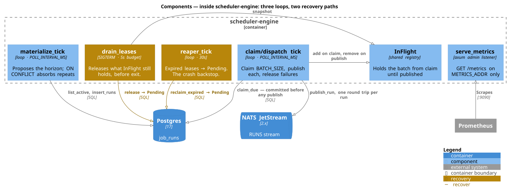
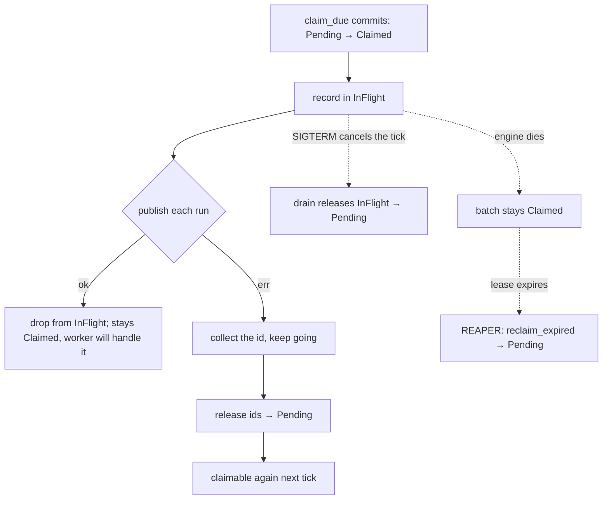

# Architecture

This document is about *why*, not *where*. The crate layout is discoverable by reading `Cargo.toml` and `ls`; the reasoning behind the handful of decisions that actually shape this system is not, and until now it lived only in commit messages and doc comments.

Everything below is checkable against the code. Where a property is pinned by a test, the test is named. Where the rationale for something could not be reconstructed from the tree, that is said rather than invented.

> **Related documents.** [README.md](README.md) is the overview and the limitations list. [DEVELOPERS.md](DEVELOPERS.md) is the hands-on guide — build, run, test, extend. [deploy/README.md](deploy/README.md) and [deploy/k8s/README.md](deploy/k8s/README.md) cover shipping it.

---

## How to read this

Three audiences want three different paths through the same material.

| If you are… | Read, in this order |
|---|---|
| **An architect** deciding whether the design is sound | [The shape in one picture](#the-shape-in-one-picture) → [Why hexagonal](#why-hexagonal) → [Delivery semantics](#delivery-semantics) → [What is deliberately absent](#what-is-deliberately-absent) |
| **A developer** about to change something | [The shape in one picture](#the-shape-in-one-picture) → [The claim](#the-claim) → [The run state machine](#the-run-state-machine) → [The dual write](#the-dual-write-at-claim-then-publish) → [the invariant table](#the-invariants-and-where-they-are-enforced) |
| **On the devops side**, operating it | [The failure modes](#the-failure-modes-and-what-recovers-each) → [The dual write](#the-dual-write-at-claim-then-publish) → [Partitioning](#partitioning-job_runs) → [Measurement](#measurement-and-the-redis-decision) → [Distributed tracing](#distributed-tracing) |

### The decision index

Every argued decision in this document, with its verdict, for skimming.

| Decision | Verdict | Where |
|---|---|---|
| Architecture style | **Hexagonal** — it maps 1:1 onto a Cargo workspace; not a performance choice | [§](#why-hexagonal) |
| Port dispatch | **Static, via RPITIT generics** — zero-cost, at the price of never being object-safe | [§](#the-consequence-and-how-to-check-it) |
| Coordinator for claiming | **None** — `FOR UPDATE SKIP LOCKED` makes concurrent claimers disjoint and non-blocking | [§](#the-claim) |
| Attempt cap enforcement | **One place only** — `claim_due`; the reaper deliberately does not also enforce it | [§](#the-run-state-machine) |
| Delivery guarantee | **At-least-once**, effectively-once at the handler; exactly-once is not offered | [§](#delivery-semantics) |
| Run instant anchoring | **Per job, at `job.created_at`** — not the clock, not a shared epoch | [§](#run-instants-are-anchored-per-job) |
| Worker step ordering | **execute → complete → ack** — the tolerable failure is a duplicate, never a lost run | [§](#the-workers-ordering-execute--complete--ack) |
| Dual write across Postgres and NATS | **Compensating release**, not an outbox — with the residual gap stated | [§](#the-dual-write-at-claim-then-publish) |
| Crashed-engine recovery | **Lease + reaper**, backing a bounded best-effort drain on SIGTERM | [§](#when-the-compensating-process-is-not-alive) |
| GraphQL N+1 | **DataLoader**, batching per resolution pass; asserted with a counting fake | [§](#why-graphql-needs-a-dataloader-when-rest-and-grpc-do-not) |
| `Job.runs` pagination | **Not built** — per-key arguments would break the batching the adapter exists to prove | [§](#what-jobruns-cannot-reach) |
| `job_runs` partition key | **Range on `scheduled_at`**, one partition per UTC day — the due scan prunes, ageing out is a `DROP` | [§](#partitioning-job_runs) |
| Per-tenant fairness | **Inside the claim SQL**, as a per-batch cap — not a rate limiter, and off by default | [§](#per-tenant-fairness) |
| Metrics before Redis | **Inverted from the spec deliberately** — measure first, then decide | [§](#measurement-and-the-redis-decision) |
| The Redis hot index | **Built, measured, ~21% slower, and wired into nothing** | [§](#the-redis-hot-index--built-then-measured) |
| Tracing transport | **OTLP/HTTP**, spans coarse, W3C propagation always on | [§](#distributed-tracing) |

---

## The shape in one picture



Every arrow in that picture points inward. That direction *is* the architectural claim, and it is checkable in one command rather than asserted in a paragraph:

```sh
cargo tree -p scheduler-domain --edges normal      # thiserror, time, uuid — nothing else
```

The five ports are the whole interface between the domain and the world.

| Port | Key methods | Implemented by | Consumed by |
|---|---|---|---|
| `Clock` | `now` | `SystemClock` in the binaries; `FixedClock` in tests | Both use cases, the GraphQL loader, the reaper |
| `JobRepository` | `insert`, `get`, `list_active` | `adapter-postgres` | All three API adapters, the materialize loop |
| `RunRepository` | `insert_runs`, `claim_due`, `claim_ids`, `release`, `reclaim_expired`, `complete`, `runs_for_jobs`, `get` | `adapter-postgres` | The engine's three loops, the worker, the API |
| `EventPublisher` | `publish_run` | `adapter-nats` | `ClaimAndDispatch` |
| `Metrics` | `incr`, `observe` | `adapter-metrics`; a no-op impl for tests | Every loop and use case |

`claim_ids` is the only port method with no production caller: it exists so the Redis due-index can claim *specific* ids rather than scanning, and [the measurement said not to wire it in](#the-redis-hot-index--built-then-measured).

---

# Part I — Structure

## Why hexagonal

Hexagonal, Onion, and Clean are one family, not three competing schools. All three enforce the same rule — source-code dependencies point *inward*, toward a domain that knows nothing about infrastructure. They differ in vocabulary and in **how many layers they mandate**, not in what they forbid. Clean is explicitly a synthesis of the other two. So the choice is about fit and teachability, and pretending otherwise would be the first dishonest sentence in this repository.

**It is not a performance decision.** In Rust the levers that actually move cost are:

1. **Dispatch strategy.** Ports here are traits, implemented as generics on the application services (`MaterializeDueRuns<R, C>`, `ClaimAndDispatch<R, P, C>`). Monomorphized generics are static dispatch — no vtable, no indirection. `Box<dyn Port>` would cost one vtable lookup per call, which is noise next to a database round trip but is avoidable, so it is avoided. This option is equally available to onion and clean.
2. **Boundary mapping count.** Each mandated layer usually means mapping one struct into another. Clean mandates the most boundaries (entities ↔ use-cases ↔ interface-adapters ↔ frameworks, plus presenters); hexagonal mandates the fewest. The difference is real and small.
3. Both of the above are dwarfed by the engine design — the `SKIP LOCKED` claim, the batch sizes, connection pooling. The architecture style is invisible next to that.

**What actually decided it** is that ports-and-adapters maps 1:1 onto a Cargo workspace: the domain crate is the core, the adapter crates are the adapters, the binaries are composition roots. Clean's presenter and interface-adapter rings would add ceremony without adding a constraint the compiler was not already enforcing.

### The consequence, and how to check it

The rule is only worth anything if it is enforced rather than asserted. `scheduler-domain` depends on no async runtime, no database driver, and no broker client:

```sh
cargo tree -p scheduler-domain --edges normal
```

Its whole dependency set is `thiserror`, `time`, and `uuid`. A future commit that reaches for `sqlx` inside the domain shows up in one line of that output.

One consequence worth naming because it is a real cost: the ports use return-position `impl Trait` in trait methods (RPITIT), which is what keeps them zero-cost, but it also makes them **not object-safe**. Nothing in this repository can hold a `Box<dyn RunRepository>`. Every consumer of a port is generic over it — including `RunsLoader<R, C>` in the GraphQL adapter, whose doc comment says exactly this. That is the trade: static dispatch everywhere in exchange for never being able to erase a port behind a trait object.

---

# Part II — Correctness

## The claim

The scheduler's core operation is: several engine replicas, no coordinator, pulling **disjoint** batches of due work out of one table.

```sql
WITH candidates AS (
    SELECT id FROM job_runs
     WHERE state = 'pending' AND scheduled_at <= $2
     ORDER BY scheduled_at
       FOR UPDATE SKIP LOCKED
     LIMIT $3
),
buried AS (                                  -- attempts exhausted: give up
    UPDATE job_runs
       SET state = 'dead', lease_owner = NULL, lease_expires_at = NULL
     WHERE id IN (SELECT id FROM candidates) AND attempt >= $5   -- MAX_ATTEMPTS
    RETURNING id
)
UPDATE job_runs                              -- the rest: claim them
   SET state = 'claimed', lease_owner = $1,
       lease_expires_at = $4,                -- now + LEASE_SECS, from Rust
       attempt = attempt + 1
 WHERE id IN (SELECT id FROM candidates) AND attempt < $5
RETURNING id, job_id, tenant, scheduled_at, state, attempt
```

(`crates/adapters/adapter-postgres/src/run_repo.rs`)

Three things in that statement are load-bearing:

- **One set of locked candidates, two disjoint outcomes.** `buried` and the primary `UPDATE` split the candidates on the `attempt` predicate, so no row is touched twice and both see the same snapshot. A data-modifying CTE runs to completion whether or not the primary query reads from it, which is why `buried` needs no reference below it.
- **`lease_expires_at` is bound (`$4`), not computed in SQL.** It used to be `now() + interval '30 seconds'` — the *database's* wall clock — which made the lease ignore the injected clock entirely and left `LEASE_SECS` as a literal duplicated into a SQL string that the in-memory fake could not share.
- **The attempt cap is enforced here and nowhere else.** See the state machine below for why the reaper deliberately does not also enforce it.



### Why the naive alternatives fail

- **`SELECT` then `UPDATE`, no locking.** Two engines read the same rows and both dispatch them. Every run is delivered twice, always, not just under crash.
- **`SELECT … FOR UPDATE` without `SKIP LOCKED`.** Correct, and serial. The second engine *blocks* on the first engine's locks instead of moving past them, so replicas queue behind each other and adding a replica adds latency rather than throughput.
- **An advisory lock or a leader.** Works, and reintroduces the coordinator the whole design is trying not to need — plus a failover story for it.
- **A dedicated queue table with `DELETE … RETURNING`.** Viable, but it throws away the run's history; this system wants the row to survive its execution so a run has a state, an attempt count, and a lease.

`SKIP LOCKED` is what makes concurrency *non-blocking*: a contended row is passed over, not waited on. That is the property, and the disjointness, the limit, the state predicate, and the attempt increment are all covered in `crates/adapters/adapter-postgres/tests/claim.rs`.

### The `ORDER BY` subtlety

`ORDER BY scheduled_at` sits in the **inner** select, where it governs *which* rows are locked and claimed: the oldest due work first. That is what stops a backlog from starving — a run that has been due for an hour is picked ahead of one that came due a second ago, every tick, regardless of batch size.

It does **not** order the batch you get back. `RETURNING` makes no promise about row order, and observably does not preserve the inner ordering. Any caller that needs the claimed batch in schedule order has to sort it itself. Nothing in this repository does — dispatch publishes each run independently, so the order it iterates in does not matter — but a reader who assumes `claim_due` returns a sorted batch would be assuming something the database never agreed to. `claim_returns_oldest_runs_first` pins exactly this distinction: it asserts on the claimed *set*, not the returned sequence.

---

## The run state machine



Four notes on this diagram:

- **The three `Claimed → Pending` edges are the same transition for three different reasons**, and they differ only in what recovers the run and how fast. `release` on a publish failure is immediate and synchronous. The drain is immediate but only on a *planned* stop. `reclaim_expired` is the backstop for a crash, and costs up to `LEASE_SECS + REAPER_INTERVAL`.
- **`Pending → Dead` is the loop-breaker, and it is enforced in exactly one place.** None of the three recovery edges decrement `attempt`, so without a ceiling a run that can never be published cycles forever. `claim_due` buries a candidate that has reached `MAX_ATTEMPTS` instead of claiming it, so no worker ever sees a run past its cap. The reaper deliberately does *not* also enforce the cap — one rule in two places is one rule that can disagree.
- **`Dead` is terminal, and it is not a queue.** Nothing republishes a dead run. There is no dead-letter stream in this repository; the `attempt` count on the row is the record of why it died.
- The terminal transitions are one-way. `complete` carries `WHERE … state NOT IN ('succeeded','failed','dead')`, so a late `Failed` cannot bury an already-recorded `Succeeded` (`complete_does_not_overwrite_a_terminal_state`), and a reaped lease cannot resurrect finished work (`reclaim_expired_does_not_resurrect_a_terminal_run`).

`RunState::Running` remains modelled and unwritten — it is permitted by the `CHECK` constraint in migration `0001_init.sql` and no code path writes it. It is there ahead of in-flight tracking rather than in use.

`release` is scoped to `state = 'claimed'` for the same reason: a compensating release races the worker it is compensating for, and it must not drag a run that has already progressed backwards.

### The invariants, and where they are enforced

Collected in one table because "where is this actually guaranteed" is the question a reader asks most often, and the answers are scattered across the schema, the SQL, the domain and the build.

| Invariant | Enforced by | Pinned by |
|---|---|---|
| A job's run at a given instant is one row, forever | `UNIQUE (job_id, scheduled_at)` + `ON CONFLICT DO NOTHING` (migration `0002`) | row-count assertion in `adapter-postgres` |
| Concurrent claimers get disjoint batches | `FOR UPDATE SKIP LOCKED` in `claim_due` | `claim.rs`, under real concurrency |
| Oldest due work is claimed first | `ORDER BY scheduled_at` in the *inner* select | `claim_returns_oldest_runs_first` |
| A terminal run never leaves its terminal state | `state NOT IN (…)` in `complete`; `state = 'claimed'` in `release` and `reclaim_expired` | `complete_does_not_overwrite_a_terminal_state`, `reclaim_expired_does_not_resurrect_a_terminal_run` |
| `attempt` never decreases | No code path decrements it; every recovery edge leaves it | the burial path in `claim_due` |
| A run past `MAX_ATTEMPTS` is never handed to a worker | The `buried` CTE, in `claim_due` and nowhere else | `claim.rs` |
| The lease outlives the broker's own redelivery window | **Compile-time assertion** in `adapter-nats` | the build itself — reverting `LEASE_SECS` to 30 fails it |
| The lease derives from the injected clock, not the database's | `lease_expires_at` is a bound parameter, not `now() + interval` | the injected-clock lease test |
| A job's run instants are fixed by the job, not the clock | `Schedule::next_after(after, anchor)` with `anchor = job.created_at` | moving-clock tests at all four levels |
| A redelivery is distinguishable from a first execution | `complete()` returns `bool` | `a_worker_that_loses_the_completion_race_reports_already_done` |
| Nested GraphQL `runs` costs one lookup, not N | `DataLoader` + `runs_for_jobs` taking a slice | `nested_runs_are_batched_into_one_lookup` (asserts call count is 1) |
| `Job.runs` returns history, not the future schedule | `scheduled_at <= $2` applied *beneath* the ranking window | `nested_runs_show_execution_history_not_the_future_schedule` |
| The domain depends on no infrastructure | The crate graph | `cargo tree -p scheduler-domain --edges normal` |
| Recording a metric never suspends | The `Metrics` port is synchronous; the adapter uses relaxed atomics | the port's signature — it cannot return a future |

---

## Delivery semantics

**At-least-once delivery, plus idempotent effects, equals *effectively-once*.**

This system does not provide exactly-once and does not claim to. Exactly-once delivery across a process boundary is not a thing a broker can give you; what you can have is a delivery guarantee that never loses work, paired with effects that are safe to apply twice. That pairing is what "effectively-once" names, and it is a property of *the handler*, not of the transport.

The concrete mechanisms, both checkable:

1. **`UNIQUE (job_id, scheduled_at)`** on `job_runs` (migration `0002_run_identity.sql`), with inserts using `ON CONFLICT DO NOTHING`. A job's run at a given instant is one run, forever — a second proposal for the same logical run carries a different surrogate `id` and loses, so the original row and the `id` already referenced by emitted events stay authoritative. The constraint lives in the schema rather than in application code because the materializer, a retried API call, and a redelivered NATS message are three independent writers, and only the database sees all three. `DO NOTHING` rather than `DO UPDATE` deliberately: an upsert would let a late materializer pass reset a run that has already been claimed or completed back to `pending`.

   This constraint is what makes successive materializer ticks idempotent, and it can only do that because the instants a tick proposes are fixed by the job rather than by the clock — see [run instants are anchored per job](#run-instants-are-anchored-per-job).

2. **`complete()` returns a `bool`.** `true` means this call performed the transition; `false` means the run was already terminal. That boolean is the duplicate-suppression primitive — it is how a worker handling a redelivered message distinguishes "I did this work" from "this work was already done", without a second query and the race between the two. Returning `()` would make the distinction undecidable at exactly the moment it matters.

### Run instants are anchored per job

`Schedule::next_after(after, anchor)` returns the smallest instant on the grid `anchor + k * every_secs` that is strictly greater than `after`. The grid is a function of the anchor and the period — never of `after`. Moving `after` forward can only *drop* instants that have gone past; it can never shift the remaining ones onto new values.

`MaterializeDueRuns` passes `job.created_at` as the anchor. So a tick proposes whatever grid points fall inside `[now, now + horizon]`, and the next tick proposes that set minus what went past, plus whatever the advanced horizon newly exposed. The overlap collides on `UNIQUE (job_id, scheduled_at)` and `ON CONFLICT DO NOTHING` drops it. Rows accrue at the schedule period.

**Why `created_at` and not the Unix epoch.** A shared epoch is simpler and needs no per-job state, but it puts every job of a given period on one grid: every 5-second job in the system fires on the same second, forever. Anchoring on each job's own creation instant spreads them naturally and costs nothing — the `jobs` table already had a `created_at` column, so there was no migration and no backfill; existing rows already carried a correct anchor. The one weakness is bulk creation: a thousand jobs seeded in the same second do share a grid. If that becomes real, the anchor is a single value in one place and can gain a deterministic per-job offset without touching anything else.

`created_at` is consequently **scheduling input, not audit metadata**. It is in `JOB_COLUMNS`, and `PgJobRepository::insert` binds it explicitly rather than letting the column's `DEFAULT now()` supply it — the value the API validated and the value the materializer reads back have to be the same instant, or the job's grid sits microseconds from where the API said it did.

**How this shipped broken.** The cursor used to start at `clock.now()` and walk forward by the period. `now` moves every tick, so each tick proposed a fresh set of instants that collided with nothing: the constraint absorbed nothing and every tick inserted a full horizon. A job with `every_secs: 5` accumulated 888 runs in about two minutes on the demo stack — roughly 7 per second, with consecutive `scheduled_at` values one second apart, matching `POLL_INTERVAL_MS` rather than the schedule.

The suite was green the whole time. Two doc comments asserted the property the code broke, and the one test covering it (`materialize_tick_proposes_the_same_instants_on_every_tick`) used `FixedClock` — under which a cursor-anchored grid and a job-anchored grid are indistinguishable, so it held vacuously. It was found by running the stack and counting rows, not by the tests. The lesson is pinned rather than written down: the moving-clock tests now live at all three levels — `next_after` in the domain, `MaterializeDueRuns` in the application, `materialize_tick` in the engine, and a row-count assertion in adapter-postgres, which is the only place `ON CONFLICT` actually runs.

### Two latent invariants around `created_at`

Both are recorded here rather than enforced, because enforcing either would be machinery built for a case that does not yet exist. Recorded so that if one does start to matter, the reasoning is already on the page.

**1. Immutability is asserted, not enforced.** `Job::created_at` is documented as stable for the life of the job (`crates/scheduler-domain/src/model.rs`), and both code paths honour it: `insert` binds the validated value explicitly, and `SELECT`s round-trip it without re-stamping. There is no `UPDATE` path for the column anywhere in the codebase. But the *schema* does not stop one — the column is plain `timestamptz`, with no trigger and no rule. So the guarded thing is the program; the unguarded thing is someone editing the row. The consequence of such an edit is not corruption but re-phasing: every future run of that job moves to a new grid, and the old grid's rows stay behind, which reads as a job that silently changed schedule without its `every_secs` changing.

**2. A bulk insert would collapse the anchors.** `PgJobRepository::insert` stamps `created_at` per request, and request timestamps differ at nanosecond resolution, so per-request creation spreads jobs across the grid exactly as intended. A bulk `INSERT ... SELECT` that let the column's `DEFAULT now()` supply the value would not: in Postgres, `now()` is **transaction start time** and is identical for every row in the statement. A thousand jobs of the same period seeded that way would share one anchor and therefore one grid — every one of them firing on the same second, which is precisely the shared-epoch failure per-job anchoring exists to prevent. No bulk path exists today. If one is added, it must bind `created_at` per row (as `insert` already does) rather than lean on the default; adding a deterministic per-job offset to the anchor is the other way out and touches one expression in one place.

The transport side is explicit about it too: the JetStream consumer uses `AckPolicy::Explicit` — `None` or `All` would acknowledge on delivery and defeat redelivery entirely — and the redelivery-on-crash behaviour is pinned by `unacked_run_is_redelivered` in `crates/adapters/adapter-nats/tests/roundtrip.rs`, which drops a message without acking and asserts it comes back. Redelivery is capped at `MAX_DELIVER = 5` so a message that can never be processed stops rather than looping forever. Nothing routes it anywhere useful afterwards — it stops being delivered and can be inspected on the stream. That is a bound, not a dead-letter queue, and this repository does not build one.

---

## The worker's ordering: execute → complete → ack

`crates/bin/scheduler-worker/src/handler.rs` exists mostly to make one ordering explicit and testable.

```
execute  →  complete  →  ack
```

The argument is entirely about which failure you prefer in the gap between two of those steps.

- **Ack first.** Crash before `complete`, and the run is **lost**: the broker believes it delivered successfully and the database never learns the run happened. There is nothing left to reconcile from.
- **Complete first (the chosen order).** Crash before `ack`, and the message is **redelivered**. The redelivered run is already terminal, `complete` reports `false`, and the second attempt skips the work and acks.

The asymmetry is the whole argument: **the tolerable failure is a duplicate delivery, never a lost run.**

Two corollaries fall out of the same reasoning:

- **If `complete` fails, the message is not acked** and the handler returns `Err`. Acking there would be the one genuinely unrecoverable move. Leaving it unacked is merely wasteful — it redelivers. (`storage_failure_during_completion_does_not_ack`)
- **A *failed* run is still acked.** The failure is already recorded, and leaving it unacked would redeliver failing work up to `max_deliver` times for no benefit. Retry policy belongs to the scheduler, not to the broker's redelivery timer.

The ordering itself is asserted directly rather than assumed: the tests record the sequence in a journal and assert `["execute", "complete", "ack"]`.

There is also a pre-execution read — the handler calls `runs.get()` and short-circuits if the run is already terminal — because `complete`'s boolean only reports a duplicate *after* the side effect has happened a second time, and re-running someone's job is not something you can take back. **That read is not a lock**; see [what is deliberately absent](#what-is-deliberately-absent).

---

## The dual write at claim-then-publish

Claiming a run flips a row in Postgres. Dispatching it publishes a message to NATS. Those are two systems and there is no transaction across them — a dual write, unavoidable without an outbox table, which this phase does not have.

`claim_due` **commits the `Claimed` flip for the whole batch before any publish is attempted.** So the failure to design around is: the flip succeeded and the publish did not. Since `claim_due` only ever selects `Pending` rows, a claimed-but-unpublished run would never be picked up again — silently lost, forever.





`ClaimAndDispatch::run` compensates in two ways, both regression-driven:

1. **One bad run does not strand the rest.** The publish loop does not short-circuit on the first error. Aborting would leave every *subsequent* run in the batch claimed and unpublished. This was a real bug; the test named `publish_failure_does_not_strand_the_rest_of_the_batch` is what pins the fix.
2. **Failures are handed back.** Everything that failed to publish is `release`d to `Pending` so a later tick claims it again (`released_run_is_claimable_again`). The runs that *did* publish stay claimed and are not republished — the returned error means "this tick was partially degraded", not "nothing happened".

`release` deliberately does **not** decrement `attempt`. The attempt really was consumed, and counting it is what lets the max-attempts policy in `claim_due` eventually terminate a run that can never be published, rather than spinning on it forever.

### When the compensating process is not alive

Compensation only helps if the process doing it survives. An engine that dies between claiming and publishing runs no compensating code at all, and its rows stay `Claimed` with nobody to hand them back. Two mechanisms cover that, and they cover different failures.

**A planned stop drains.** `run_until_shutdown` selects the shutdown branch against a pending tick, so SIGTERM *cancels* the dispatch future — possibly between the committed claim and the first publish. `InFlight` records the batch the instant the claim commits and forgets each run only once it is safely published, so a dropped future leaves exactly the unpublished remainder recorded, and `drain_leases` releases it before exit. A rollout therefore costs no recovery delay.

The drain is **bounded** at `DRAIN_BUDGET` = 5s and **best-effort**: on error or overrun it logs and returns rather than propagating. A drain that outlived the container's termination grace period would convert a recoverable delay into a stuck rollout. It is allowed to give up precisely because the reaper is behind it. It also runs only on the clean shutdown path — `try_join!` returns the instant any handle fails while its siblings still run, and releasing then could hand back a run that dispatch is mid-publish.

**A crash is reaped.** `reclaim_expired` returns runs whose `lease_expires_at` has passed to `Pending`. The `lease_owner` / `lease_expires_at` columns, written since Phase 1, are what it reads. Both of its predicates are load-bearing in opposite directions: dropping `state = 'claimed'` makes it a resurrection machine, and dropping the expiry check makes it steal live leases.

### The failure modes, and what recovers each

The operational summary of everything above. "Cost" is time-to-recovery, not data loss — nothing in this table loses a run.

| Failure | Detected by | Recovered by | Cost | Residual risk |
|---|---|---|---|---|
| Publish fails for part of a batch | The publish call's error | `release` → `Pending`, same tick | One tick | An attempt is consumed; five of these bury the run |
| Engine gets SIGTERM mid-tick | The shutdown branch cancels dispatch | `drain_leases` releases what `InFlight` holds | ≤ 5s (`DRAIN_BUDGET`) | None, if the drain completes |
| Engine crashes after claiming | Nothing — until the lease expires | `reclaim_expired` → `Pending` | ≤ `LEASE_SECS + REAPER_INTERVAL` = **150s** | Runs are late, never lost |
| Worker crashes before acking | JetStream's `ACK_WAIT` | Redelivery, up to `MAX_DELIVER` | ≤ 5s per attempt | The side effect may have happened once already |
| Worker crashes after `complete`, before `ack` | JetStream's `ACK_WAIT` | Redelivery; `complete` returns `false`, the work is skipped | ≤ 5s | None |
| `complete` itself fails | The handler returns `Err`, no ack | Redelivery | ≤ 5s | The work is repeated |
| A run can never be published | `attempt` climbing on every cycle | `claim_due` buries it as `Dead` | 5 attempts | **Work is abandoned.** No dead-letter queue, no replay |
| The lease expires while the worker is still executing | Nothing can tell this from a crash | The reaper republishes the run | — | **Duplicate execution, caused by the recovery mechanism** |
| Two engines claim at once | Not a failure | `SKIP LOCKED` — batches are disjoint | None | None |
| A tick re-proposes existing instants | Not a failure | `UNIQUE (job_id, scheduled_at)` + `ON CONFLICT DO NOTHING` | None | None |

### The exposure that remains

Nothing can recover a crashed engine's batch faster than the lease it holds, because **a live lease and a slow one are indistinguishable**. Worst case is `LEASE_SECS + REAPER_INTERVAL` = 150s before an abandoned run is claimable again. That is a liveness cost; the rows are in the table with their full history throughout.

The sharper residual risk points the other way. If a lease expires while a worker is legitimately still executing, the reaper returns the run to `Pending`, a later tick publishes it again, and **the reaper has caused a duplicate execution rather than repaired a lost one**. `complete()` is idempotent and reports `false` on the duplicate, so the run still reaches one terminal state once — the duplicate is safe to *record*. Nothing makes it safe to *execute* against a target that is not itself idempotent.

`LEASE_SECS` is sized to make that rare, not impossible:

```
LEASE_SECS > publish + queue_wait + ACK_WAIT * (MAX_DELIVER - 1) + exec + complete
```

Only the redelivery window (5s × 4 = 20s) is bounded by anything in this repository; queue wait is backlog depth over worker count. At the 30s this lease used to be, the broker's own ordinary redelivery could consume two thirds of it. At 120s it consumes a sixth, and a compile-time assertion in `adapter-nats` keeps it that way. See [the tuning table in the README](README.md#tuning-the-three-constants-that-have-to-agree) for the three constants together.

Today the exposure is theoretical in one specific sense worth stating: the worker's `LoggingExecutor` simulates execution and does not call `target`, so a duplicate currently duplicates a log line. It becomes real the moment a genuine executor lands, which is why the fencing token is listed below as not built.

---

## Why GraphQL needs a DataLoader when REST and gRPC do not

REST and gRPC make the caller ask for each thing explicitly. `GET /runs/{id}` is one read. `GetRun` is one read. The client controls the fan-out because the client writes the loop.

GraphQL inverts that. `{ jobs { runs { id state } } }` is one request, and the `runs` field resolves **once per job in the result set**. With 200 jobs that is 200 database round trips issued by a single query the client did not think of as expensive. This N+1 fan-out is GraphQL's characteristic performance failure, and it is the one real cost GraphQL adds over the other two surfaces.

The fix is structural, not a cache. `DataLoader` collects the job ids requested within a resolution pass and calls `RunsLoader::load` **once**; the loader hands the whole slice to `RunRepository::runs_for_jobs`, which resolves it in one query. The batching is asserted with a counting fake rather than assumed — `nested_runs_are_batched_into_one_lookup` in `crates/adapters/api-graphql/tests/graphql.rs` fails if the call count is not 1.

The port takes a *slice* and returns a *flat `Vec`*; the adapter groups the result itself. Returning a `HashMap` would push one adapter's preferred collection type into a port that two other adapters also implement against.

### The related contract point: `runs_for_jobs` is bounded in time

`runs_for_jobs(job_ids, before, limit_per_job)` takes a time bound, and it is not optional. This is the subtle one, and it was found by running the demo stack rather than by any test.

**This scheduler writes ahead of now.** The materializer creates `Pending` runs a horizon into the future (`HORIZON_SECS`, 300 seconds by default and 60 in the demo compose file), so for any actively-scheduled job, "the newest runs for this job" is *entirely future rows*. An unbounded newest-first window spends its whole per-job limit on runs that have not happened yet and can never show a completed one — which is what a caller asking "show me this job's runs" actually means.

Measured on the demo stack with a 5-second job before the bound existed: 82 runs had reached `succeeded`, `Job.runs` returned 50 rows, all `pending`, and the *oldest* row in that 50-row window was still 41 seconds in the future. No completed run could have appeared in it at any point.

Two details make the bound work:

- **The filter is applied before ranking, not after.** `scheduled_at <= $2` sits in the inner query, beneath the `ROW_NUMBER() OVER (PARTITION BY job_id ORDER BY scheduled_at DESC)`. Filtering a newest-first window after the fact still spends the limit on future rows and returns near-zero past ones.
- **The clock is read per load, not at schema build.** The schema is constructed once at process start and serves requests for the life of the process; a timestamp captured there would be stale within seconds and frozen forever. `RunsLoader` therefore holds a `Clock` (the domain port) and calls `now()` inside `load`.

The result is that a caller passing `now` gets execution *history* and a caller passing a future instant gets the upcoming *schedule* — the caller chooses, instead of being handed whichever rows the materializer happened to have written. `nested_runs_show_execution_history_not_the_future_schedule` pins it.

The `limit_per_job` bound is the less interesting of the two but is also not optional, and it is genuinely *per job* rather than a cap on the result set. A plain `LIMIT` would happily return every row for one job and nothing for the others, and a test asserting only the total would not notice.

### What `Job.runs` cannot reach

The paragraph above says "the caller chooses". On the port, that is true. On the only live consumer, it is not, and the gap is worth stating plainly rather than leaving implied.

`JobNode::runs` takes **no arguments**. `before` is always `clock.now()`, and `limit_per_job` is always `RUNS_PER_JOB = 50`, fixed in the composition root. So the field answers exactly one question — "the 50 most recent runs at or before now" — and no client can ask a different one. There is no cursor, no offset, and no `before` argument. On a 5-second job that is about the last four minutes of history, and everything older is unreachable over GraphQL permanently. REST and gRPC do not close the gap either: both fetch a run by id, so they can *confirm* an older run the caller already knows about, but neither can enumerate.

**Why it was left that way.** Adding `before`/`limit` to the field is not a one-line change, because per-key arguments are what break `DataLoader` batching. The loader's key is `JobId`; two jobs in one result set requested with different `before` values cannot share a batched call keyed on the id alone. Making it correct means keying on `(JobId, before, limit)`, at which point the batch is only one call when every key in the pass happens to agree on the arguments — and `nested_runs_are_batched_into_one_lookup`, which asserts the call count is 1, would still pass while pinning a strictly weaker property than the one it was written for. The N+1 fan-out is the reason this adapter exists in the shape it does; trading a sharp test of it for pagination on a surface that has no authentication and no cursor contract is the wrong trade at this phase.

The honest summary is that the bound belongs on the field and the field does not have it yet. What makes that tolerable rather than broken is that the port already takes both bounds, so the change is additive when it is worth making: the field gains arguments, the loader key becomes a tuple, and the batching test gains a case that fixes the arguments across keys so it still means "one call for N jobs". None of that requires touching the port, the repository, or the SQL.

---

# Part III — Operations and scale

## Partitioning `job_runs`

`job_runs` is `PARTITION BY RANGE (scheduled_at)`, one partition per UTC day. The key is `scheduled_at` and not `tenant` for two reasons that both come from how the table is actually used:

- **The due scan prunes.** The claim reads `WHERE state = 'pending' AND scheduled_at <= now`, so a range on `scheduled_at` lets the planner skip every partition wholly in the future — the bulk of a materialized horizon — and read only the recent ones. A tenant-hash partition would prune nothing for that query.
- **Ageing out is a `DROP`, not a `DELETE`.** Once every run in a day is terminal, the whole day's partition can be dropped in one metadata operation. On a plain table the same cleanup is a `DELETE` that scans and writes tombstones across the live index the claim depends on. This is the growth path the 100M target needs, and it is why partitioning is here rather than a `DELETE` job.

### What the partition key forced

Postgres requires the partition column in every unique or primary key. The primary key therefore changed from `(id)` to `(id, scheduled_at)` — `id` stays first so it remains the surrogate key that event payloads and lease bookkeeping reference; `scheduled_at` is appended only to satisfy the rule. The existing `UNIQUE (job_id, scheduled_at)` already contained the key, so it was recreated unchanged and `insert_runs`' `ON CONFLICT (job_id, scheduled_at)` still resolves against the parent. The proof that none of this changed behaviour is that all 41 `claim.rs` tests pass **unmodified** against the partitioned table.

### The DEFAULT partition, and maintenance

A `DEFAULT` partition catches any `scheduled_at` outside every range, so an insert can never fail for want of a partition — a row landing there is a monitorable signal that maintenance is behind, never a hard error. The `0005` migration seeds a starter week of daily partitions; that is deliberately not a production maintenance strategy. **Production must create partitions ahead of the horizon and drop old ones** — the `adapter-postgres` `ensure_partitions` / `drop_partitions_before` helpers are exactly that, meant to run on a schedule (a K8s `CronJob`, or `pg_partman` at larger scale). A migration cannot create future partitions forever, and the seeded week silently routing everything to `DEFAULT` after seven days would be a slow, invisible regression — hence the helpers and this note.

## Per-tenant fairness

The claim orders due runs oldest-first, so a single tenant that falls far behind — thousands of overdue runs, all older than everyone else's — would fill every batch and starve every other tenant indefinitely. `claim_due`'s `per_tenant_cap` bounds that: with a positive cap, no tenant contributes more than `cap` runs to one batch.

**The cap lives in the claim SQL, not above it.** Claiming the unfair set and then discarding the excess would waste claims (each is a committed state flip and a lease) and still let the noisy tenant's rows crowd out the query's `LIMIT` before the quiet tenant's are ever seen. So the fair set is chosen *inside* the query: a `ranked` CTE numbers each tenant's due runs with `ROW_NUMBER() OVER (PARTITION BY tenant ORDER BY scheduled_at)`, and `candidates` admits only rows with `rn <= cap`. The window function is in its own CTE because Postgres forbids `FOR UPDATE` in a query that uses one — `candidates` does the `SKIP LOCKED` locking over the already-ranked fair set.

**It is a per-batch cap, not a token-bucket rate limiter, and the docs say so.** A capped tenant is still claimed on every tick — it simply cannot take the whole tick. That is enough to stop starvation, which is the failure this addresses; a true per-second rate limit is a different, larger mechanism and is not built. The default is `0` (off), so the reference behaviour is unchanged unless a deployment sets `PER_TENANT_CAP`.

## Deployment topology


Three properties of the runtime shape are worth stating here rather than only in the manifests, because they are consequences of decisions argued above.

**Engine replicas need no coordination and no configuration.** `SKIP LOCKED` makes concurrent claimers disjoint, and each replica's lease owner comes from `HOSTNAME` — which Kubernetes sets to the pod name — so `kubectl scale` is the whole story. Getting this wrong in the other direction is the failure to watch for: two replicas sharing one `SCHEDULER_OWNER` make lease attribution meaningless, and the reaper can no longer tell whose lease expired.

**The autoscaling signals differ by role because the bottlenecks differ.** Workers scale on CPU, because execution is the work and replicas are drop-in consumers of one durable queue group. The engine scales on `due_lag_seconds` p95, because claim lateness is the direct measure of the due queue draining slower than the dispatchers can keep up — and it is a scheduler-specific signal that no generic CPU metric would surface.

**The drain and the grace period have to agree.** `terminationGracePeriodSeconds: 30` against a `DRAIN_BUDGET` of 5s is deliberate slack: the drain is bounded so that it finishes well inside the grace period, because a drain that outlived it would turn a recoverable delay into a stuck rollout. That is the same argument as [the drain being best-effort](#when-the-compensating-process-is-not-alive), seen from the cluster's side.

The production caveats — demo-grade Postgres and NATS on `emptyDir`, a throwaway `Secret`, no `NetworkPolicy`, no `ServiceMonitor` — are enumerated in [deploy/k8s/README.md](deploy/k8s/README.md).

## Distributed tracing

Metrics tell you *how many* and *how fast*; a trace tells you *where one run's time went*. For a scheduler that spans three processes joined only by a NATS message, the interesting trace is a single run's journey from dispatch to execution — and that journey crosses a boundary no in-process tracer sees.

**The trace context rides the message.** When the engine publishes a run, it injects the dispatching span's W3C `traceparent` into the NATS message headers; when the worker consumes it, it extracts that context and parents its `execute_run` span to it. So dispatch and execution are one trace, not two. The inject/extract is the whole mechanism, and it is unit-tested against a real `HeaderMap` — a traceparent injected on publish is the same one extracted on consume, and absent headers yield the empty context rather than a fabricated parent. The propagator (W3C) is set globally in every role's `init_tracing`, unconditionally, so the propagation is never a silent no-op even when no exporter is configured.

**Export is opt-in and cheap when off.** With `OTEL_EXPORTER_OTLP_ENDPOINT` set, spans go to that OTLP/HTTP collector under the role's service name (`scheduler-api` / `-engine` / `-worker`); unset, tracing stays in the logs and the only cost is the (free) context propagation. HTTP rather than gRPC on purpose — the grpc-tonic exporter would drag a second `tonic` version in beside api-grpc's 0.14. The dependency lives only in the binaries and `adapter-nats`; `scheduler-domain` stays free of it, as of everything else.

**What is deliberately shallow.** The spans are coarse — a `dispatch` span per tick and an `execute_run` span per run — not fine-grained instrumentation of every query and publish. The point here is the *cross-process* correlation, which is the part that is hard to get right and impossible to add later without the context propagation; deeper spans are a later refinement, not a prerequisite.

---

# Part IV — Measurement

## Measurement, and the Redis decision

The spec sequences a Redis "hot index" *before* observability. This implementation inverts that deliberately, and the inversion is the point: **measure first, then decide**, because a cache added to fix an unobserved bottleneck is the same unevidenced claim this design keeps trying to avoid.

### How metrics stay out of the hexagon

Recording is a domain *port* — a synchronous `Metrics` trait over a closed `Metric` enum — with a std-only Prometheus adapter behind it. Two properties are load-bearing:

- **Synchronous.** Recording must not be an `await` point. An instrumented hot loop that could suspend at every measurement changes the thing it measures, so the port cannot return a future, and the adapter records with a relaxed atomic and no lock — a keyed-registry-behind-a-mutex client (the usual `metrics` facade) was rejected precisely because it takes a lock on the claim loop.
- **The enum is closed.** A metric name cannot be a string a typo silently mis-records; every metric maps to a fixed slot, and the adapter is the one place the name/bucket mapping lives.

`runs_buried` is the interesting one to place: burial happens *inside* `claim_due`'s CTE and the run is excluded from the returned batch, so no later stage can see it. Rather than change the port for every caller, `claim_due` returns a `ClaimOutcome { claimed, buried }` that derefs to the claimed slice — callers that only want the runs are unchanged — and the Postgres query became a tagged `UNION ALL` so the buried count survives even a pass that buries runs but claims none.

Each process serves its own registry on an admin `/metrics` port (`METRICS_ADDR`), never the public API surface: the exposition format discloses tenant counts and traffic shape.

### What the bench measured

On a 4-core laptop, Postgres and NATS in Docker sharing the host with the load generator (jobs=200, interval=60s, horizon=3600s, batch=500, 3 reps):

| | |
|---|---|
| materialize / tick | ~1.34 s for 200 jobs (~6.7 ms/job), 12,000 proposed |
| claim throughput | ~678 runs/s, single claimer (657–691) |
| due-lag (exact, n=36,000) | p50 1751 s · p95 3363 s · p99 3542 s |
| claim loop time split | `SKIP LOCKED` **3%** · NATS publish **97%** |

### The decision

The claim query — the mechanism Redis would replace — is **3%** of the claim loop. The 97% is one synchronous publish round-trip per run, over Docker's port forward, from a single-threaded harness: a property of how the bench is written, not of the scheduler. due-lag here is backlog-drain saturation, not steady-state lateness.

So the evidence does **not** support building Redis for speed. It would accelerate a step that is not the bottleneck. The measurement that *would* justify it, and which this laptop bench deliberately does not attempt, is many concurrent claimers against a non-containerised database: that is where `SKIP LOCKED` contention, the only thing a hot index addresses, would first appear.

## The Redis hot index — built, then measured

It was built anyway, as a reference exercise, on the principle that *building it and measuring it* is a more useful answer than either omitting it or asserting it works. The result confirms the prediction.

**The design keeps Redis a hint, never a source of truth.** `adapter-redis` is a sorted set (`sched:due`) that scores each pending run's id by `scheduled_at`. The hot path is `pop_due` (pop the ids due now, no Postgres scan) followed by `claim_ids` (claim *exactly those ids* in Postgres under `SKIP LOCKED`). Postgres decides: a stale id (already claimed) matches nothing in `claim_ids` and is dropped; a wiped index just sends the engine back to the `claim_due` scan. The `hint_invariant` tests pin this — the hot path agrees with the scan, `FLUSHDB` loses nothing, and a stale hint is never re-claimed. That is what keeps a second store from becoming a second, disagreeing answer to "what is claimable".

**And the bench shows it does not help — it hurts.** On the same backlog, claim only:

| | |
|---|---|
| scan (`claim_due`) | ~19,700 runs/s |
| redis (`pop_due` + `claim_ids`) | ~15,500 runs/s |

The index is ~21% *slower*. It adds a `pop_due` round-trip per batch and still does the same `claim_ids` write, so it can only pay off if the scan it replaces were the bottleneck — which it is not. The reference value here is the method, not the cache: the hot index exists in the tree, its correctness is proven, and its measured verdict is recorded. It is wired into nothing by default; the engine still claims via the scan. If the concurrent-claimer measurement above ever shows `SKIP LOCKED` contention dominating, the pieces to swap in are already here and already tested.

---

# Part V — Absences

## What is deliberately absent

Absences worth defending, as opposed to things merely not done yet.

**Authentication and authorization, on all three surfaces.** There is none. This is a reference implementation, and a half-real auth story — a hardcoded bearer token, a tenant header nobody checks — would be worse than an explicit absence, because it would look like a design someone could learn from. The tenant is a field on the request body, trusted completely.

**Exclusive execution.** The worker's pre-execution read is not a lock, and nothing else is either. Two workers can both observe a run as non-terminal and both execute it. At-least-once tolerates that by design and `complete` keeps the *recording* single, but the *side effect* is not single. Making execution itself exclusive needs a fencing token, which is still not built — and the reaper widens the case slightly, since an expired lease can put a second copy of a still-running run back in the queue. `a_worker_that_loses_the_completion_race_reports_already_done` pins the part that is handled: the losing worker must not claim it recorded an outcome the database never took.

**A real executor.** `LoggingExecutor` records the run and reports success; it does not call `target`. Real outbound calls bring timeouts, retries, TLS and SSRF protection with them, none of which this phase covers, and a fake that pretended to be an HTTP client would be worse than an obvious placeholder.

**An outbox.** It would remove the dual write described above. It also introduces a second table, a relay process, and its own ordering questions — which is a phase of work, not a paragraph. The compensating release is the cheaper answer that covers the common failure, and the residual gap is stated rather than papered over.

**A dead-letter queue.** `MAX_DELIVER = 5` bounds broker redelivery and `MAX_ATTEMPTS = 5` buries an exhausted run as `Dead`. Neither is a *queue*: nothing republishes a dead run, no stream carries them, and there is no replay path. `Dead` is a terminal state and the `attempt` count on the row is the record of why it died. Building the replay half properly is deferred rather than half-built.

**TLS on gRPC.** The server is `tonic::transport::Server::builder()` with no TLS configuration. The expectation is a mesh or ingress that terminates it. Nothing enforces that expectation.

**Server reflection on gRPC.** Not enabled, so a client needs the `.proto`. This one is a genuine convenience cost with no rationale recorded in the tree — it appears to be scope rather than a decision, and it is called out here rather than dressed up as one.

**A production capacity number.** There is now a bench (`cargo run -p bench`) and there are measured figures — see [Measurement, and the Redis decision](#measurement-and-the-redis-decision) above — but they are a laptop-with-Docker floor, not a production ceiling, and the 100M target is still designed-for and unverified. The engine loop's own tick counter remains explicitly *not* a throughput metric: it reports runs *proposed*, not created, because `insert_runs` does not surface an affected-row count, and that has not changed.
