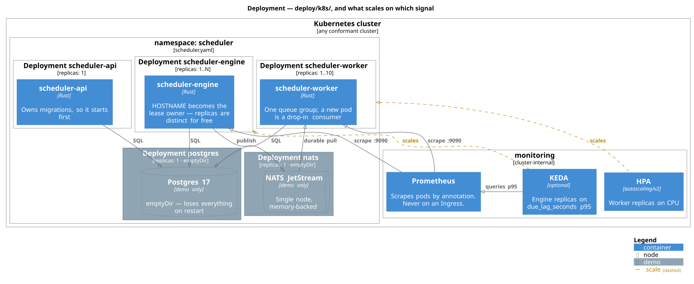

# Developer guide

Everything hands-on: what to install, how to run the stack, how to drive all three surfaces, how to run the tests and the bench, and where to put new code. The *why* behind any of it is in [ARCHITECTURE.md](ARCHITECTURE.md); the overview is in [README.md](README.md).

- [What you need](#what-you-need)
- [Quick start](#quick-start)
- [Running the containers](#running-the-containers)
- [Environment variables](#environment-variables)
- [Driving the three surfaces](#driving-the-three-surfaces)
- [Running the tests](#running-the-tests)
- [The gate that has to pass](#the-gate-that-has-to-pass)
- [Running the bench](#running-the-bench)
- [Observability, locally](#observability-locally)
- [Running on Kubernetes](#running-on-kubernetes)
- [Working in the codebase](#working-in-the-codebase)
- [Regenerating the diagrams](#regenerating-the-diagrams)
- [Troubleshooting](#troubleshooting)

---

## What you need

| Tool | Version | Why |
|---|---|---|
| **Rust** | 1.88.0 | Pinned by `rust-toolchain.toml`, with `rustfmt` and `clippy`. `rustup` reads it automatically — you do not need to select a toolchain by hand. |
| **A container runtime** | Docker, Colima, Podman… | Required for the integration tests (testcontainers starts real Postgres, NATS and Redis) and for the compose demo. Unit tests do not need it. |
| **`grpcurl`** | optional | Only to poke the gRPC surface by hand. Not part of this project's toolchain and not installed by anything here. |
| **Java** | optional, 11+ | Only to re-render the C4 diagrams. The rendered SVGs are committed, so reading the docs needs nothing. |

There is **no `protoc`** requirement. `api-grpc` compiles its `.proto` with `protox`, a pure-Rust protobuf compiler, so a fresh clone builds with nothing but a Rust toolchain.

## Quick start

```sh
git clone <this-repo> && cd distributed-job-scheduler
cargo build --workspace            # ~16 crates, no external codegen tools needed
cargo test -p scheduler-domain     # pure unit tests, no containers required
```

To exercise the whole system, bring up the demo stack — that is the next section.

---

## Running the containers

`deploy/docker-compose.yml` builds one image and runs it three times, once per role, alongside Postgres and NATS.

```sh
docker compose -f deploy/docker-compose.yml up --build -d      # start
docker compose -f deploy/docker-compose.yml ps                 # what is up
docker compose -f deploy/docker-compose.yml logs -f engine worker   # watch it work
docker compose -f deploy/docker-compose.yml down -v             # stop, volumes included
```

The first build compiles the workspace in release mode and takes a while; subsequent builds reuse the cargo layer. The caching strategy is explained in [`deploy/README.md`](deploy/README.md).

### What is published, and what deliberately is not

| Host port | Service | Surface |
|---|---|---|
| `8080` | api | REST, plus GraphQL at `/graphql` (GraphiQL playground on `GET`) |
| `50051` | api | gRPC, `scheduler.v1.Scheduler` |
| `9090` | api | Prometheus `/metrics` — registry is **empty**, the API does no scheduling |
| `9091` | engine | Prometheus `/metrics` — claim throughput, due-lag, reclaim and burial rates live here |
| `9092` | worker | Prometheus `/metrics` — carries `execution_seconds` |
| *(none)* | postgres | Not published: binding 5432 collides with a Postgres you already run |
| *(none)* | nats | Not published, same reason |

To inspect the database or the broker directly, uncomment the `ports:` line in the compose file — ideally on a non-default host port such as `55432:5432`.

Every role binds `0.0.0.0`, never `127.0.0.1`. A loopback bind inside a container serves nothing through a published port: the mapping succeeds and every connection is refused, which reads as "the server is down" rather than "the server is bound to the wrong interface".

### Startup ordering

Postgres and NATS have healthchecks, and the roles wait on them, so nothing crash-loops on first start. Beyond that there are two real dependencies worth knowing about:

- **The API owns migrations.** The engine and worker can start before the schema lands. Their loops tolerate that, but a failure during *startup wiring* exits, and `restart: on-failure` is the honest recovery.
- **The engine creates the `RUNS` stream.** The worker binds its consumer at startup and exits if the stream is not there yet. Again: restart-on-failure, rather than a retry loop inside the binary that would hide the ordering dependency instead of expressing it.

### Scaling a role locally

```sh
docker compose -f deploy/docker-compose.yml up -d --scale worker=3
```

Workers share one durable NATS queue group, so extra replicas are drop-in consumers. Scaling the **engine** additionally requires that each replica has a distinct lease owner — remove the `SCHEDULER_OWNER: engine-1` line from the compose file and let it fall back to the container hostname, which Docker makes unique. Without that, `runs_reclaimed` becomes meaningless because the reaper cannot attribute an expired lease.

---

## Environment variables

Parsed once, in `crates/bin/scheduler-common/src/lib.rs`, so all three roles agree. Two behaviours are deliberate and worth knowing before you debug a config problem: **an empty value reads as absent** (`FOO=""` is what a compose file writes for a variable unset upstream, and it takes the default instead of binding an empty string), and **a malformed numeric value fails at startup** rather than silently falling back to the default — a production tuning change that silently does nothing is worse than a crash.

| Variable | Default | Roles | Notes |
|---|---|---|---|
| `DATABASE_URL` | **required** | all | No default on purpose: a wrong default is how a process silently connects to the wrong database and appears to work. |
| `NATS_URL` | **required** | all | |
| `HTTP_ADDR` | `0.0.0.0:8080` | api | REST + GraphQL. |
| `GRPC_ADDR` | `0.0.0.0:50051` | api | Its own listener, because tonic needs HTTP/2 with its own service stack. |
| `METRICS_ADDR` | `0.0.0.0:9090` | all | Admin listener, serving `/metrics` and nothing else. Keep it off public networks. |
| `BATCH_SIZE` | `100` | engine | Runs claimed per tick. Must be positive. |
| `HORIZON_SECS` | `300` | engine | How far ahead the materializer proposes runs. Must be positive. |
| `POLL_INTERVAL_MS` | `1000` | engine | Tick interval for materialize and claim. `0` is rejected — it would busy-loop. |
| `PER_TENANT_CAP` | `0` (off) | engine | Max runs one tenant may contribute to a claim batch. Set a positive value to stop a backlogged tenant from starving the others. |
| `SCHEDULER_OWNER` | `$HOSTNAME`, else a fresh UUID | engine | The lease owner. Must be distinct per replica — under Kubernetes the `HOSTNAME` fallback gives you that for free. |
| `RUST_LOG` | `info` | all | Standard `tracing` filter syntax. |
| `OTEL_EXPORTER_OTLP_ENDPOINT` | unset | all | When set, spans are exported to that OTLP/**HTTP** collector. Unset, tracing goes to the logs only — and W3C context still propagates across NATS, because the propagator is installed unconditionally. |

Bench-only knobs are listed under [Running the bench](#running-the-bench).

---

## Driving the three surfaces

All three go through the same domain constructors, so an empty tenant or an out-of-range interval is rejected identically on each.

### REST

```sh
# create a job on a 5-second interval
curl -sS -XPOST localhost:8080/jobs \
  -H 'content-type: application/json' \
  -d '{"tenant":"acme","target":"http://example.invalid/run",
       "schedule":{"type":"interval","every_secs":5}}'
# => {"id":"..."}

# read a run (run ids appear in the engine and worker logs)
curl -sS localhost:8080/runs/<run-id>
# => {"id":"...","job_id":"...","state":"succeeded","attempt":1,"scheduled_at":"..."}

curl -sS localhost:8080/jobs/<job-id>
curl -sS localhost:8080/health     # liveness — does not touch the database
curl -sS localhost:8080/ready      # readiness — does
```

### GraphQL

The GraphiQL playground is on `GET localhost:8080/graphql` in a browser; queries POST to the same path.

```sh
curl -sS -XPOST localhost:8080/graphql \
  -H 'content-type: application/json' \
  -d '{"query":"query($id: ID!) { job(id: $id) { id tenant schedule runs { id state attempt } } }",
       "variables":{"id":"<job-id>"}}'
```

Mutations are `createJob(tenant:, target:, everySecs:)`. Two behaviours will surprise you if you have not read the architecture notes: nested `runs` returns **execution history** — the 50 most recent runs at or before now — not the future schedule the materializer has already written; and the schema enforces a maximum query complexity of 256 with `jobs(limit:)` clamped to 200.

### gRPC

The service is `scheduler.v1.Scheduler` on port 50051, with `CreateJob`, `GetJob` and `GetRun`. Server reflection is **not** enabled, so a client needs the schema at `crates/adapters/api-grpc/proto/scheduler.proto`.

```sh
grpcurl -plaintext -import-path crates/adapters/api-grpc/proto \
  -proto scheduler.proto \
  -d '{"tenant":"acme","target":"http://example.invalid/run","every_secs":5}' \
  localhost:50051 scheduler.v1.Scheduler/CreateJob
```

Without `grpcurl`, `crates/e2e/tests/end_to_end.rs` drives the same RPCs from a real tonic client over a real socket, and is the executable version of this example.

---

## Running the tests

```sh
cargo test --workspace --locked
```

Integration tests start real Postgres, NATS and Redis containers via testcontainers, so a container runtime must be available. One container is shared per test binary rather than per test — see `crates/test-support/`.

**On macOS with Docker Desktop** the socket is not at the default path, and testcontainers will fail to connect without this:

```sh
export DOCKER_HOST="unix:///Users/$USER/.docker/run/docker.sock"
```

**Container reaping caveat.** testcontainers 0.23 has no reaper, and its `Drop` cannot await, so containers outlive the test process and accumulate across runs. Clean them up with:

```sh
# Only containers with no compose project -- i.e. testcontainers' own.
# Filtering by image alone would also delete a running deploy/ demo, whose
# Postgres and NATS use the same images.
docker ps -a --filter ancestor=postgres:17-alpine --filter ancestor=nats:2-alpine \
  --format '{{.ID}} {{.Label "com.docker.compose.project"}}' \
  | awk '$2==""{print $1}' | xargs -r docker rm -f
```

To run only the parts that need no containers:

```sh
cargo test -p scheduler-domain -p scheduler-application
```

`scheduler-application` exposes its in-memory fakes behind a `testing` feature, so they are available to other crates' tests without ever being compiled into a production binary.

## The gate that has to pass

This is what CI runs, and what should pass before any commit:

```sh
cargo fmt --all --check
cargo clippy --workspace --all-targets --all-features -- -D warnings
cargo test --workspace --locked
```

CI additionally builds the demo image and asserts all three binaries are present and runnable inside it, which is what catches a Dockerfile that has drifted from the workspace.

---

## Running the bench

```sh
cargo run -p bench
```

It starts its own Postgres, NATS and Redis containers, materializes a backlog, and reports the claim and materialize costs, the due-lag distribution, where the claim loop's time actually went, and the Redis-versus-scan comparison. It finishes by printing what the numbers do **not** tell you, which is the part worth reading.

| Variable | Default | Meaning |
|---|---|---|
| `BENCH_JOBS` | `200` | Jobs to seed |
| `BENCH_INTERVAL_SECS` | `60` | Each job's schedule period |
| `BENCH_HORIZON_SECS` | `3600` | How far ahead to materialize |
| `BENCH_BATCH` | `500` | Claim batch size |
| `BENCH_REPS` | `3` | Repetitions, for a spread rather than a single number |

Treat the output as a laptop-with-Docker floor, not a production ceiling. The published figures and the decision they drove are in [README](README.md#measured-behaviour) and [ARCHITECTURE](ARCHITECTURE.md#measurement-and-the-redis-decision).

---

## Observability, locally

**Metrics.** Each role serves its own registry, so scrape all three:

```sh
curl -sS localhost:9090/metrics    # api    (empty registry by design)
curl -sS localhost:9091/metrics    # engine (the interesting one)
curl -sS localhost:9092/metrics    # worker (execution_seconds)
```

If `runs_released` or `publish_failures` is climbing, publishes are failing and the compensation path is doing its job. If `runs_reclaimed` is nonzero in steady state, engines are dying. If `runs_buried` is nonzero, work is being abandoned at `MAX_ATTEMPTS`.

**Traces.** Point every role at an OTLP/HTTP collector and one run becomes one trace spanning the engine and the worker:

```sh
OTEL_EXPORTER_OTLP_ENDPOINT=http://localhost:4318 \
  docker compose -f deploy/docker-compose.yml up -d
```

The spans are deliberately coarse — a `dispatch` span per tick and an `execute_run` span per run. The point is the cross-process correlation over NATS, which is the part that is impossible to add later without the context propagation being there from the start.

---

## Running on Kubernetes

Manifests are in `deploy/k8s/`, and their design notes and production caveats are in [`deploy/k8s/README.md`](deploy/k8s/README.md).



```sh
docker build -f deploy/Dockerfile -t distributed-job-scheduler:latest .
kind load docker-image distributed-job-scheduler:latest     # or: minikube image load …

kubectl apply -f deploy/k8s/scheduler.yaml
kubectl apply -f deploy/k8s/autoscaling.yaml   # HPA applies anywhere; the KEDA object needs KEDA
kubectl -n scheduler get pods
kubectl -n scheduler port-forward svc/scheduler-api 8080:8080 50051:50051
```

Scaling the engine needs nothing extra: `SCHEDULER_OWNER` is deliberately left unset so `Config` falls back to `HOSTNAME`, which Kubernetes sets to the pod name, so every replica gets a distinct lease owner for free and `SKIP LOCKED` keeps the concurrent claimers from colliding.

```sh
kubectl -n scheduler scale deploy/scheduler-engine --replicas=3
```

The bundled Postgres and NATS are demo Deployments on `emptyDir` and lose everything on restart. Do not point anything you care about at them.

---

## Working in the codebase

### The one rule

`scheduler-domain` depends on no async runtime, no database driver and no broker client. That is enforceable rather than aspirational:

```sh
cargo tree -p scheduler-domain --edges normal      # thiserror, time, uuid — and nothing else
```

A commit that reaches for `sqlx` inside the domain shows up in one line of that output. The structure this produces is the subject of [the component diagram](ARCHITECTURE.md#the-shape-in-one-picture).

### Where things go

| You want to… | Touch |
|---|---|
| Add a field or an invariant to a job or run | `crates/scheduler-domain/src/model.rs` — validation lives in the constructors so all three surfaces reject the same input |
| Add a capability the domain needs from the outside | A trait in `crates/scheduler-domain/src/ports.rs`, then an implementation in an adapter crate |
| Add a use case | `crates/scheduler-application/src/use_cases.rs`, generic over the ports it needs |
| Change the claim, or add a query | `crates/adapters/adapter-postgres/src/run_repo.rs`, plus a test in `tests/claim.rs` |
| Add a migration | `crates/adapters/adapter-postgres/migrations/`, numbered; the API applies them at startup |
| Add a metric | A variant on `Metric` in the domain, then its name and buckets in `adapter-metrics` — the enum is closed on purpose, so a typo cannot silently mis-record |
| Add a new API surface | A new crate under `crates/adapters/`, wired in `crates/bin/scheduler-api/src/main.rs` |
| Change a role's loops | `crates/bin/scheduler-engine/src/loops.rs` or `crates/bin/scheduler-worker/src/handler.rs` |

### Two things that will trip you up

**Ports are not object-safe.** They use return-position `impl Trait` in trait methods, which is what keeps them zero-cost, and the price is that nothing can hold a `Box<dyn RunRepository>`. Every consumer of a port is generic over it. If you find yourself wanting a trait object, you are fighting a deliberate trade — see [ARCHITECTURE](ARCHITECTURE.md#why-hexagonal).

**Nothing in the application layer reads the system clock.** `Clock` is a port; tests inject `FixedClock`. A `now()` call inside a use case is a bug, and a subtle one: a whole class of scheduling regression is invisible to tests under a fixed clock, which is exactly how the [per-job anchoring bug](ARCHITECTURE.md#run-instants-are-anchored-per-job) shipped green.

---

## Regenerating the diagrams

The C4 sources live in `docs/diagrams/*.puml` and the rendered SVGs are committed beside them, so reading the docs needs no toolchain. After editing a source:

```sh
./docs/diagrams/render.sh          # requires Java; downloads a pinned PlantUML into .cache/
```

Commit both the `.puml` and the regenerated `.svg`. The C4 macros in `docs/diagrams/lib/` are vendored from [C4-PlantUML](https://github.com/plantuml-stdlib/C4-PlantUML) (MIT, pinned) so rendering works offline, and Graphviz is not required — the script selects PlantUML's own pure-Java layout engine.

---

## Troubleshooting

| Symptom | Cause | Fix |
|---|---|---|
| Tests fail to start containers on macOS | Docker Desktop's socket is not at the default path | `export DOCKER_HOST="unix:///Users/$USER/.docker/run/docker.sock"` |
| Containers pile up after test runs | testcontainers 0.23 has no reaper | The `docker rm -f` one-liner [above](#running-the-tests) |
| `jetstream not enabled for account` | NATS started without JetStream | The server needs `-js`; the compose file already passes it |
| Worker exits at startup, restarts | It bound its consumer before the engine created the `RUNS` stream | Expected on first boot; `restart: on-failure` resolves it |
| Engine logs errors right after `up` | The API had not finished applying migrations | Expected on first boot; the loops retry |
| A port mapping connects to nothing | A role bound `127.0.0.1` inside its container | Bind `0.0.0.0` — that is the default for a reason |
| `DATABASE_URL is required` with the variable "set" | It is set to an empty string; empty reads as absent | Give it a real value, or unset it and use the default where one exists |
| Runs accumulate far faster than the schedule period | A materializer anchored on the clock rather than on the job | Fixed; if it recurs, read [run instants are anchored per job](ARCHITECTURE.md#run-instants-are-anchored-per-job) |
| `runs_reclaimed` climbing in steady state | Engine replicas are dying, or sharing one `SCHEDULER_OWNER` | Give each replica a distinct owner, or unset it and let `HOSTNAME` do it |
| A run executed twice | The lease expired while the worker was still executing | Expected under the current design — see [the reaper's cost](README.md#a-run-can-be-executed-twice-if-its-worker-is-slower-than-the-lease) |
