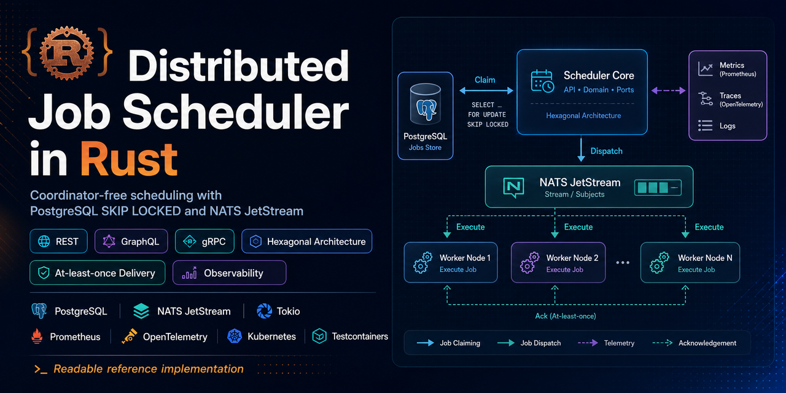
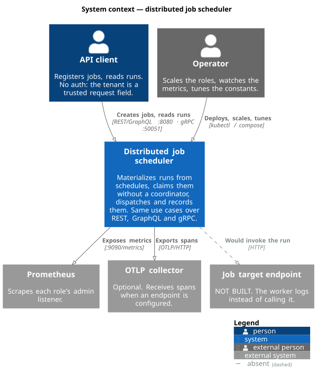
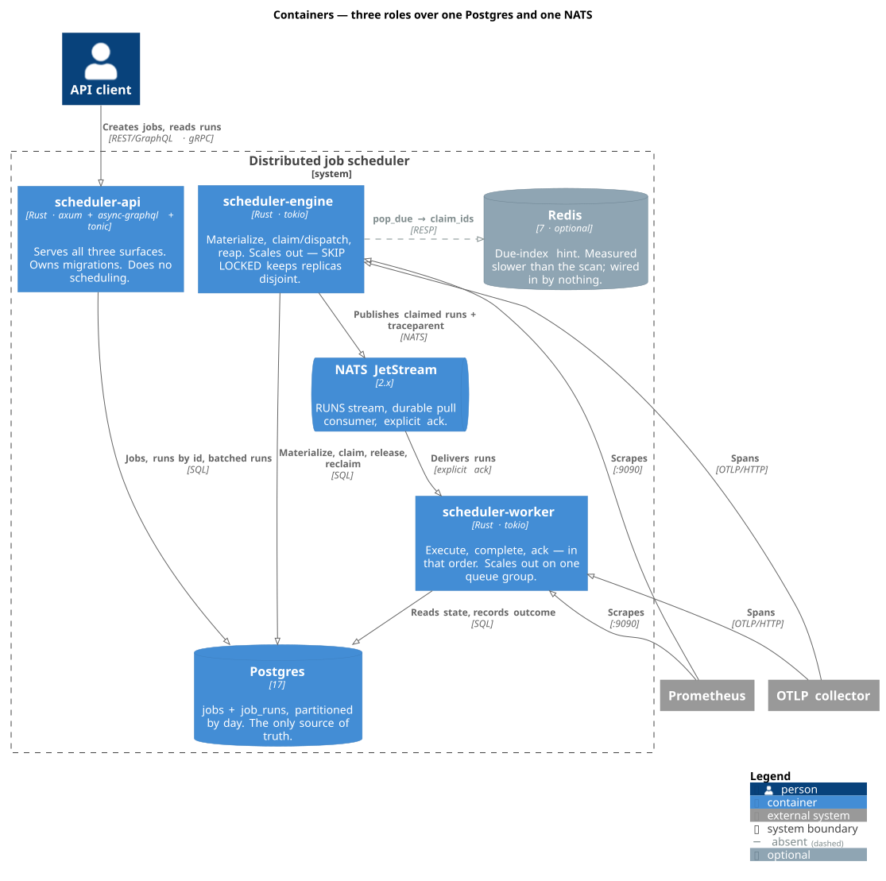

# distributed-job-scheduler

[](https://github.com/SaumilP/distributed-job-scheduler/actions/workflows/ci.yml)
[](DEVELOPERS.md#running-the-tests)
[](rust-toolchain.toml)
[](ARCHITECTURE.md)
[](LICENSE)

A distributed job scheduler in Rust: you register a job with a schedule, and three cooperating services materialize its runs, claim them without a coordinator, dispatch them over NATS JetStream, and record what happened. The same use cases are exposed over **REST, GraphQL and gRPC**, so the three surfaces can be compared side by side against identical domain logic.

It is a reference implementation for a [blog series](https://www.saumilp.dev/blog/distributed-scheduler-design-the-claim/), written to be read. If you are here to see how `FOR UPDATE SKIP LOCKED` claiming, at-least-once delivery, and hexagonal architecture look in real Rust rather than in a diagram, this is aimed at you. If you are looking for something to run in production, read [Limitations](#limitations) first — the answer is no, and the reasons are the interesting part.

| | |
|---|---|
| **Language** | Rust 1.88.0, one Cargo workspace, 16 crates |
| **Runtime shape** | 3 deployable roles · Postgres 17 · NATS 2.x JetStream |
| **Surfaces** | REST + GraphQL (`:8080`) · gRPC (`:50051`) · Prometheus (`:9090`) |
| **Delivery** | At-least-once, effectively-once at the handler |
| **Tests** | Integration tests against real Postgres and NATS via testcontainers |

---

## Start here

Three readers want three different documents, so the material is split rather than interleaved.

| If you are… | Read | For |
|---|---|---|
| **An architect** evaluating the design | **[ARCHITECTURE.md](ARCHITECTURE.md)** | Why hexagonal over onion or clean, why the claim query is shaped the way it is, why delivery is *effectively-once* and never exactly-once, and what is deliberately missing. Every decision is argued, not asserted. |
| **A developer** running or extending it | **[DEVELOPERS.md](DEVELOPERS.md)** | Toolchain, the compose stack, driving all three surfaces, running the tests and the bench, the full environment-variable reference, and where to add a port or an adapter. |
| **On the devops side** deploying it | **[deploy/README.md](deploy/README.md)** and **[deploy/k8s/README.md](deploy/k8s/README.md)** | The Dockerfile's caching strategy, startup ordering, scaling a role, the Kubernetes manifests, and HPA/KEDA autoscaling signals. |

The rest of this file is the overview all three share.

---

## Architecture at a glance

<p align="center">
  
</p>

---

## System context



Two things in that picture are worth naming immediately, because they bound everything else. **There is no authentication on any surface** — the tenant is a field on the request body and it is trusted completely. And **the job target is never called**: the worker logs the run and reports success, because a fake that pretended to be an HTTP client would teach the wrong thing. Both are expanded under [Limitations](#limitations).

---

## The demo

Postgres, NATS (JetStream) and the three roles, in one command:

```sh
docker compose -f deploy/docker-compose.yml up --build -d
```

Create a job on a 5-second interval:

```sh
curl -sS -XPOST localhost:8080/jobs \
  -H 'content-type: application/json' \
  -d '{"tenant":"acme","target":"http://example.invalid/run",
       "schedule":{"type":"interval","every_secs":5}}'
```

Watch it flow through — the engine materializes and claims, the worker executes and records:

```sh
docker compose -f deploy/docker-compose.yml logs -f engine worker
```

Tear it down, volumes included:

```sh
docker compose -f deploy/docker-compose.yml down -v
```

Two ports are published: **8080** (REST, plus GraphQL at `/graphql`) and **50051** (gRPC). Postgres and NATS deliberately are not, so the stack cannot collide with ones you already run. Full walkthrough, including the metrics ports and every environment variable, is in [DEVELOPERS.md](DEVELOPERS.md).

---

## The three roles



| Role | Loop | Scales by | Notes |
|---|---|---|---|
| **`scheduler-api`** | request/response | replicas behind a service | Serves REST, GraphQL and gRPC from one composition root, and owns the migrations. Does no scheduling, so its metrics registry is empty. |
| **`scheduler-engine`** | materialize · claim/dispatch · reap | replicas; `SKIP LOCKED` keeps them disjoint | The interesting role. Claims batches with no coordinator and no leader election, publishes each run, and hands back anything it could not publish. |
| **`scheduler-worker`** | consume · execute · complete · ack | replicas sharing one durable queue group | The ordering is the design: complete *before* ack, so a crash costs a redelivery rather than a lost run. |

Postgres is the single source of truth for what is claimable. NATS carries dispatch, not state. Redis appears in the tree as an optional due-index hint and is wired into nothing — [it was built, measured, and found slower](#the-bottleneck-and-what-it-means-for-redis).

---

## The three surfaces

All three are driving adapters over the same ports, and all three go through the same domain constructors — so an empty tenant or an out-of-range interval is rejected identically on each. The end-to-end test creates a job over gRPC and asserts REST and GraphQL report the same run, with the same id and the same state.

| Surface | Endpoint | Shape |
|---|---|---|
| **REST** | `:8080` | `POST /jobs`, `GET /jobs/{id}`, `GET /runs/{id}`, `GET /health` (does not touch the database), `GET /ready` (does). |
| **GraphQL** | `:8080/graphql` | GraphiQL playground on `GET`. Nested `Job.runs` resolves through a `DataLoader`, so a hundred jobs still cost one run lookup. Returns execution *history* — runs at or before now — not the future schedule the materializer has already written. |
| **gRPC** | `:50051` | `scheduler.v1.Scheduler` with `CreateJob`, `GetJob`, `GetRun`. Server reflection is not enabled, so a client needs `crates/adapters/api-grpc/proto/scheduler.proto`. |

There is no `protoc` anywhere in this repository: `api-grpc` compiles its `.proto` with `protox`, a pure-Rust protobuf compiler, so a clone builds with nothing but a Rust toolchain. Worked examples for all three — including `grpcurl` — are in [DEVELOPERS.md](DEVELOPERS.md#driving-the-three-surfaces).

---

## Observability, and what has been measured

Every role records Prometheus metrics through a synchronous, domain-defined port and serves them on its own admin listener at `GET /metrics` (`METRICS_ADDR`, default `0.0.0.0:9090`). A dedicated port, **not** the public API surface: `/metrics` discloses tenant counts and traffic shape, which has no place on an unauthenticated public listener. Each process exposes only its own registry — the engine and worker hold the interesting numbers; nothing aggregates across them.

| Metric | Kind | Role | What it tells you |
|---|---|---|---|
| `runs_materialized` | counter | engine | runs *proposed* per tick — not created; the DB absorbs duplicates |
| `runs_claimed` | counter | engine | claim throughput |
| `claim_batch_size` | histogram | engine | batches full (saturated) or short (idle) |
| `runs_published` / `publish_failures` | counter | engine | the dual-write's success and failure rates |
| `runs_released` | counter | engine | compensation rate — nonzero means publishes are failing |
| `runs_reclaimed` | counter | engine | engine-crash rate — nonzero in steady state means engines are dying |
| `runs_buried` | counter | engine | attempts exhausted; nonzero means work is being abandoned |
| `due_lag_seconds` | histogram | engine | `now − scheduled_at` at claim time — how late runs are |
| `execution_seconds` | histogram | worker | execution wall time; the input to the `LEASE_SECS` argument |

### Measured behaviour

`cargo run -p bench` drives real Postgres and NATS and reports these. The numbers below are from a **4-core laptop with Docker, the database sharing the host with the load generator** (jobs=200, interval=60s, horizon=3600s, batch=500, 3 reps):

- **materialize cost per tick:** ~1.34 s for 200 jobs (~6.7 ms/job), 12,000 runs proposed
- **claim throughput:** ~678 runs/s, single claimer (657–691, ~5% spread)
- **due-lag, exact over 36,000 samples:** p50 1751 s, p95 3363 s, p99 3542 s — the backlog-drain saturation case, not steady-state lateness

**This is a laptop-with-Docker figure, not a production capacity statement.** The 100M-schedule target remains designed-for and **unverified**; the bench prints, and refuses to extrapolate past, everything each number excludes.

### The bottleneck, and what it means for Redis

The bench splits the claim loop's time: the `SELECT … FOR UPDATE SKIP LOCKED` claim query is **3%** of it; the synchronous per-run NATS publish is **97%**. The claim path — the exact mechanism a Redis "hot index" would replace — is **not** the bottleneck here. What dominates is one publish round-trip per run over Docker's port forward from a single-threaded loop, a property of the harness's shape rather than of the scheduler.

**On this evidence a Redis hot path is not warranted for speed** — it would accelerate a step that costs ~3% of the measured time. It was nonetheless built (`adapter-redis`) as a reference exercise and measured: on the same backlog it runs ~21% *slower* than the scan, because the index adds a round-trip and the scan it replaces was never the bottleneck. The measurement that *would* justify it, which this laptop bench cannot do, is many concurrent claimers against a non-containerised database — where `SKIP LOCKED` contention would first appear. The full write-up is in [ARCHITECTURE.md](ARCHITECTURE.md#the-redis-hot-index--built-then-measured).

---

## Limitations

Stated specifically, because for a reference implementation these are the most useful part of the document. Each row links to where the trade is argued in full; the two that would bite hardest are expanded underneath.

| Limitation | What it costs you | Argued in |
|---|---|---|
| **No authentication or authorization, on any surface** | Anyone who can reach `:8080` or `:50051` can create, read and schedule jobs for any tenant | [below](#there-is-no-authentication-or-authorization-on-any-surface) |
| **No TLS on gRPC** | The server expects a mesh or ingress to terminate TLS; nothing here enforces that | [ARCHITECTURE](ARCHITECTURE.md#what-is-deliberately-absent) |
| **The worker simulates execution** | `target` is never called — a run "succeeds" by being logged | [ARCHITECTURE](ARCHITECTURE.md#what-is-deliberately-absent) |
| **Execution is not exclusive** | Two workers can execute one run; only the *recording* is single | [ARCHITECTURE](ARCHITECTURE.md#what-is-deliberately-absent) |
| **A crashed engine's batch waits out the lease** | Up to `LEASE_SECS + REAPER_INTERVAL` = 150s before recovery. A *planned* stop drains instead and costs nothing | [below](#an-engine-that-dies-mid-batch-is-recovered-within-a-window) |
| **A slow worker can be duplicated by the reaper** | If a lease expires mid-execution the run is republished — the reaper causes a duplicate rather than repairing a loss | [below](#a-run-can-be-executed-twice-if-its-worker-is-slower-than-the-lease) |
| **Delivery is at-least-once, never exactly-once** | Duplicates are possible by design; the effects are keyed so they are harmless to *record* | [ARCHITECTURE](ARCHITECTURE.md#delivery-semantics) |
| **GraphQL cannot reach run history older than the most recent 50** | `Job.runs` takes no arguments — no cursor, no `before`, no offset | [ARCHITECTURE](ARCHITECTURE.md#what-jobruns-cannot-reach) |
| **GraphQL is bounded by complexity, not really by depth** | Complexity 256 does the work; no data query can reach the depth limit of 8 | [ARCHITECTURE](ARCHITECTURE.md#why-graphql-needs-a-dataloader-when-rest-and-grpc-do-not) |
| **No dead-letter queue** | `Dead` is a terminal state, not a queue: nothing republishes a dead run and there is no replay path | [ARCHITECTURE](ARCHITECTURE.md#what-is-deliberately-absent) |
| **No production capacity figure** | The bench measures a laptop-with-Docker floor; the 100M target is designed-for and unverified | [above](#measured-behaviour) |

### There is no authentication or authorization, on any surface

**Anyone who can reach port 8080 or 50051 can create, read and schedule jobs for any tenant.** The tenant is a field in the request body and it is trusted completely. There is no token, no session, no per-tenant check, and nothing that would refuse a request.

This is the single most important caveat in this file. Do not expose these ports to a network you do not control. A half-real auth story would be worse than an explicit absence, so the absence is explicit. The same applies to `/metrics`, which is unauthenticated and discloses tenant counts and traffic shape.

### An engine that dies mid-batch is recovered, within a window

`claim_due` commits the `Claimed` flip before any publish, so a *publish* failure is compensated: the affected runs are released back to `Pending` and claimed again on a later tick. An engine that **dies** between claiming and releasing runs no compensating code at all, and its batch used to sit `Claimed` with nothing to hand it back. Two things now hand it back:

- **A planned stop drains.** On SIGTERM the engine releases what it has claimed and not yet published, bounded by a 5-second budget. A rollout therefore costs no recovery delay at all. If the drain fails or overruns, it gives up and exits — the reaper below is the backstop, which is what makes giving up safe.
- **A crash is reaped.** The `lease_owner` / `lease_expires_at` columns are written on every claim, and the reaper loop reads them: a run whose lease has expired goes back to `Pending` and is claimed again.

**The residual exposure is the reclaim window.** Nothing can recover a crashed engine's batch faster than the lease it holds, because a live lease is indistinguishable from a slow one. Worst case is `LEASE_SECS + REAPER_INTERVAL` = 150 seconds before an abandoned run is claimable again. It is a liveness cost, not a durability one — the runs are in the table throughout.

### A run can be executed twice if its worker is slower than the lease

This is the honest cost of the reaper, and it points the opposite way to the gap above.

The lease starts at the **claim**, not at delivery. If it expires while a worker is legitimately still executing, the reaper does exactly what it is built to do — returns the run to `Pending` — and a later tick publishes it a *second* time. The reaper has then **caused** a duplicate execution rather than repaired a lost one.

`complete()` is idempotent and reports `false` on the duplicate, so the run still reaches one terminal state, once: the duplicate is safe to **record**. Nothing makes it safe to **execute**. If the target is not itself idempotent, it ran twice. `LEASE_SECS` is sized to make this rare rather than to make it impossible — see below. It cannot be made impossible here: queue wait is backlog depth over worker count, and no constant in this repository bounds it.

### Tuning: the three constants that have to agree

They are documented together because their *relationship* is what makes the design correct, not their individual values.

| Constant | Value | Where |
|---|---|---|
| `LEASE_SECS` | 120s | `scheduler-domain/src/model.rs` |
| `MAX_ATTEMPTS` | 5 | `scheduler-domain/src/model.rs` |
| `REAPER_INTERVAL` | 30s | `scheduler-engine/src/loops.rs` |
| (`ACK_WAIT` / `MAX_DELIVER`) | 5s / 5 | `adapter-nats/src/consumer.rs` |

**`LEASE_SECS` must outlive a legitimate execution.** The full path from claim to terminal state is publish + queue wait + the broker's redelivery window + execution + completion:

```
LEASE_SECS > publish + queue_wait + ACK_WAIT * (MAX_DELIVER - 1) + exec + complete
```

Only the redelivery window is bounded by anything here: 5s × 4 = **20s**, and reaching it is ordinary behaviour — a worker restarting mid-rollout does. At the 30s this lease used to be, that left 10 seconds for everything else. At 120 it leaves 100. The inequality against `ACK_WAIT` and `MAX_DELIVER` is enforced by a compile-time assertion in `adapter-nats`; reverting `LEASE_SECS` to 30 fails the build.

**`REAPER_INTERVAL` trails the lease.** Nothing becomes reclaimable until a lease has expired, so sweeping faster finds the same nothing more often — at the cost of a lock-taking scan per interval per replica. 30s is a quarter of the lease: enough to add only a fraction to recovery latency, slow enough not to be the hot path.

**`MAX_ATTEMPTS` terminates the loop the other two create.** Every retry path returns a run to `Pending` and none of them decrement `attempt` — a publish failure releases, a dead engine gets reaped. Without a ceiling a run that can never be published cycles forever, and the reaper makes that loop *tighter*, not looser. At the cap, `claim_due` moves the run to `Dead` instead of claiming it. `Dead` is a terminal **state, not a queue**: nothing republishes a dead run, and there is no dead-letter stream in this repository. The `attempt` count on the row is the record of why it died.

### Not built

- **A dead-letter queue.** Redelivery is capped at 5 and then simply stops, and a run that exhausts `MAX_ATTEMPTS` becomes `Dead`. Neither is a queue: nothing republishes a dead run, and there is no replay path. That is deliberately deferred rather than half-built.
- **A fencing token.** The reaper can return a run to `Pending` while its original worker is still executing, and nothing stops that worker's side effect.
- **The Redis hot path** — *built* (`adapter-redis`, a due-index behind a hint-not-truth invariant) and *measured*: on the same backlog it is ~21% **slower** than the Postgres scan it would replace. It is wired into nothing by default; the engine still claims via the scan.
- **`RunState::Running`** exists in the model and is permitted by the schema's `CHECK` constraint, but no code path writes it. (`Dead` is written, by `claim_due`, when a run exhausts `MAX_ATTEMPTS`.)
- **A production capacity figure.** Everything else the spec named for Phase 3 — Prometheus metrics and `/metrics`, the bench, table partitioning, per-tenant fairness, the Redis hot index, Kubernetes manifests with HPA/KEDA, and OpenTelemetry tracing — *is* built.

---

## Layout

```
crates/
  scheduler-domain/          model + ports, zero infrastructure dependencies
  scheduler-application/     use cases over the ports
  adapters/
    adapter-postgres/        Job/Run repositories over Postgres
    adapter-nats/            EventPublisher + durable pull consumer
    adapter-metrics/         std-only Prometheus registry for the Metrics port
    adapter-redis/           due-index hot path (a hint; Postgres stays truth)
    api-rest/                REST driving adapter
    api-graphql/             GraphQL driving adapter + DataLoader
    api-grpc/                gRPC driving adapter (protox, no protoc)
  bin/
    scheduler-common/        config, tracing, clock, shutdown, /metrics server
    scheduler-api/           serves REST, GraphQL and gRPC; owns migrations
    scheduler-engine/        materialize + claim/dispatch loops
    scheduler-worker/        consume, execute, complete, ack
  bench/                     load harness over real Postgres + NATS (dev-only)
  test-support/              container fixtures (dev-only)
  e2e/                       end-to-end test across all three surfaces
deploy/                      Dockerfile + docker-compose demo + k8s manifests
docs/diagrams/               C4 sources (.puml) and rendered SVGs
```

The domain crate depends on no runtime, no database driver and no broker client. That is checkable rather than aspirational:

```sh
cargo tree -p scheduler-domain --edges normal
```

Its whole dependency set is `thiserror`, `time`, and `uuid`. The ports-and-adapters structure that rule produces is the subject of [the component diagram in ARCHITECTURE.md](ARCHITECTURE.md#the-shape-in-one-picture).

---

## Where to go next

- **[ARCHITECTURE.md](ARCHITECTURE.md)** — the reasoning, decision by decision, with a decision index at the top.
- **[DEVELOPERS.md](DEVELOPERS.md)** — build it, run it, test it, extend it.
- **[deploy/README.md](deploy/README.md)** and **[deploy/k8s/README.md](deploy/k8s/README.md)** — ship it.
- **[CONTRIBUTING.md](CONTRIBUTING.md)** — the gate, the constraints a change has to respect, and which of the gaps above are worth closing.

---

## Contributing

The [Not built](#not-built) list is the backlog: a dead-letter path, cursor pagination on `Job.runs`, a fencing token, batched publishing, an auth adapter. Each was deferred with a reason, so [CONTRIBUTING.md](CONTRIBUTING.md) starts from those reasons rather than from a style guide. Questions about the design belong in [Discussions](https://github.com/SaumilP/distributed-job-scheduler/discussions); reproducible faults in [Issues](https://github.com/SaumilP/distributed-job-scheduler/issues) — though several of the surprising behaviours here are [documented rather than broken](#limitations).

Participation is governed by the [Code of Conduct](CODE_OF_CONDUCT.md). Licensed [MIT](LICENSE).
